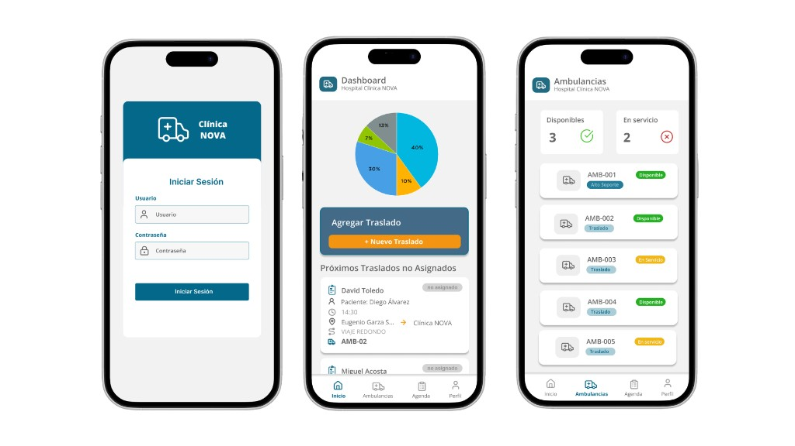
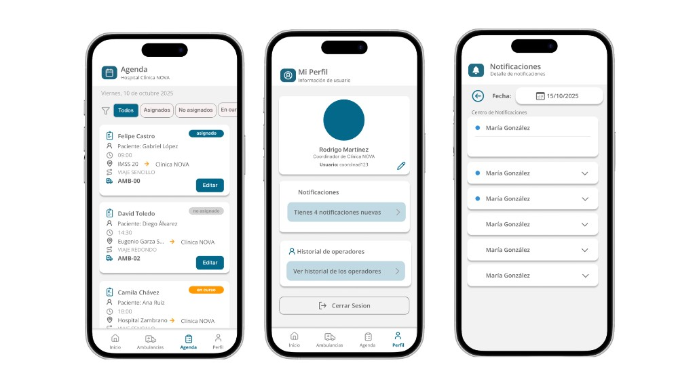

# App Nova AMS — Coordinador

**Ambulance System Manager** para **Hospital Clínica NOVA**: app móvil con la que el **coordinador** inicia sesión, consulta un **panel operativo** (indicadores y próximos traslados), supervisa el **estado de la flota**, gestiona la **agenda de traslados** (filtros por asignación y curso), atiende **notificaciones** y administra su **perfil** e **historial de operadores**. Todo frente al backend corporativo vía API y canales en tiempo real.

## Stack

| Capa | Tecnología |
|------|------------|
| Cliente | **Swift**, **SwiftUI**, **iOS** |
| Red | **REST (HTTP/JSON)** · **WebSocket** |
| Estado / sesión | **SwiftUI** (`@AppStorage`, `UserDefaults`) |
| IDE | **Xcode** · proyecto `AppNovaAMSCoord.xcodeproj` |

## Capturas

*Acceso, resumen de operación y listado de ambulancias (disponibles / en servicio).*

*Agenda con filtros por estado, perfil del coordinador y centro de notificaciones.*

## Ejecución

Abre `AppNovaAMSCoord/AppNovaAMSCoord.xcodeproj` en Xcode, selecciona el destino iOS y **Run** (⌘R). Las URLs del backend están en el código; ajústalas según el entorno.
